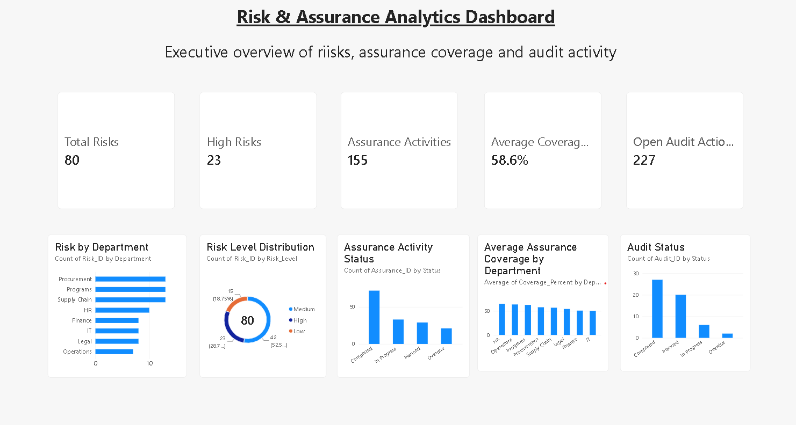
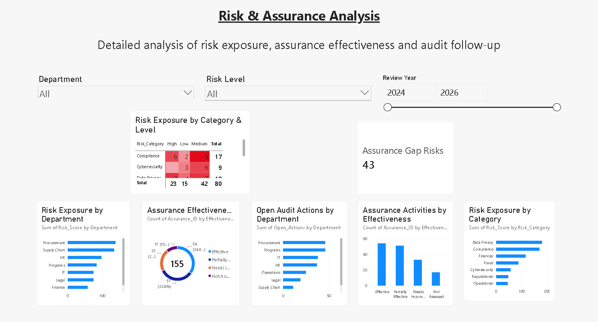

# Risk & Assurance Analytics Dashboard

An interactive Power BI dashboard designed to analyze risk exposure, assurance effectiveness, assurance gaps, and audit follow-up activities across different departments and risk categories.

## 📊 Project Overview

The Risk & Assurance Analytics Dashboard provides an interactive view of organizational risk and assurance data.

It helps users understand risk exposure, evaluate assurance activities, identify assurance gaps, and monitor open audit actions through interactive visualizations and filters.

## 🎯 Objectives

- Analyze risk exposure across departments
- Identify high, medium, and low-risk areas
- Evaluate assurance effectiveness
- Monitor open audit actions
- Identify assurance gap risks
- Compare risk exposure across different categories
- Analyze risk and assurance data across review years
- Support data-driven risk and assurance decisions

## 📌 Dashboard Features

### Executive Assurance Overview

The executive overview provides a high-level summary of key risk and assurance metrics, including:

- Total Risks
- High Risks
- Assurance Activities
- Average Coverage
- Open Audit Actions

### Risk & Assurance Analysis

The detailed analysis page provides:

- Risk Exposure by Category & Level
- Risk Exposure by Department
- Assurance Effectiveness
- Open Audit Actions by Department
- Assurance Activities by Effectiveness
- Risk Exposure by Category
- Assurance Gap Risks

### Interactive Filters

Users can filter the dashboard using:

- Department
- Risk Level
- Review Year

## 📈 Key Insights

The dashboard enables users to identify:

- Departments with higher risk exposure
- High-risk categories requiring attention
- Areas with assurance gaps
- Departments with a high number of open audit actions
- Effectiveness of assurance activities
- Differences in risk exposure across categories
- Changes in risk and assurance metrics across review years

## 🛠️ Tools & Technologies

- Microsoft Power BI
- Power Query
- DAX
- Data Visualization
- Business Intelligence
- Risk Analytics
- Interactive Reporting
## 🖼️ Dashboard Preview

### Executive Assurance Overview



### Risk & Assurance Analysis


 
## 💡 Skills Demonstrated

- Power BI Dashboard Development
- Data Cleaning & Transformation
- DAX
- KPI Development
- Data Visualization
- Risk Analytics
- Business Intelligence
- Interactive Dashboard Design
- Data Analysis

## 👨‍💻 Author

**Aditya Pandey**

B.Tech in Artificial Intelligence & Machine Learning

---

⭐ If you found this project useful, feel free to explore the dashboard and its implementation.

## 📂 Project Structure

```text
Risk-Assurance-Analytics-Dashboard/
│
├── Risk_Assurance_Analytics_Dashboard.pbix
├── README.md
│
└── screenshots/
    ├── executive-overview.png
    └── risk-assurance-analysis.png